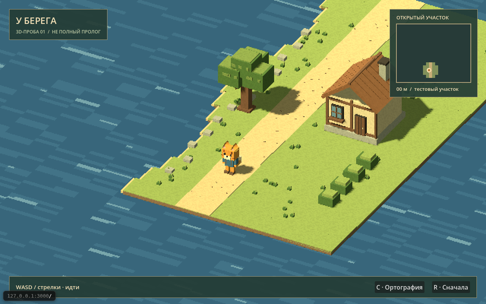
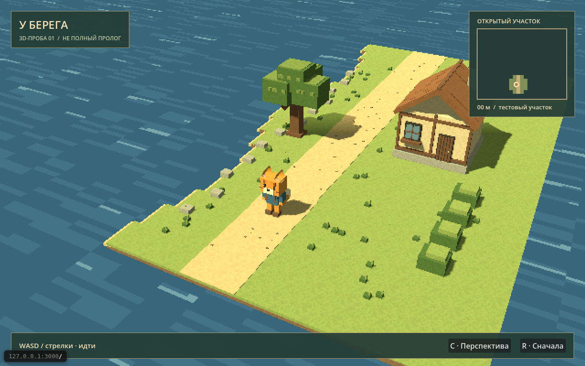

# Управляемая 3D-проба пролога

**Техническая проба, не полный пролог и не утверждённый арт.** Создана по разрешению автора от 06.09.2026 21:08 UTC: Godot, без досок у озера. География, название экрана и временная внешность кота не задают сюжет.

Godot **4.7.2 stable**, GDScript, **Forward+** (решение автора 11.09.2026: «движку плевать на веб, улучшай» — переход с GL Compatibility, дал glow/SSAO/volumetric fog по умолчанию; цена — Web-экспорт и dev-Preview в браузере песочницы Hoplite больше не поддерживаются, WebGL2 не тянет Vulkan). Редактор и шаблоны одной версии. Оригинальная геометрия и маленькие текстуры строятся из исходников при запуске. Платные ассеты, внешняя генерация и моделлер не нужны.

## Что можно проверить

- Объёмные дорога/берег/дерево/дом и кот на двух лапах, простая ходьба и поворот.
- Старт С1 (К2): после ввода имени идёт короткая катсцена — по улице в обе стороны едут машины, кот сходит на бетонно-каменную, затем лесную тропу, останавливается у таблички «через 500 метров клубничные запасы» и получает управление в лесу на 0 м. Лес плотно ограничивает тропу с двух сторон: пройти можно по расчищенному пути. Дома в начале нет. Пустое имя даёт техническое имя по умолчанию; экранная клавиатура Deck пока не проверена на устройстве.
- На 40 м стоит крупная церковь К4 высотой больше десяти котов: открытый вход обращён к дороге, путь по основной дороге не перекрыт. Внутри есть исповедальня: кот и священник находятся по разные стороны сплошной стенки. Пока используется явная реплика-заглушка без портрета, кармы и награды; сюжетный текст ждёт автора.
- Рядом с церковью всегда стоит пожилой кот-попрошайка. Он принимает одну порцию еды или одну монетку; первая успешная подсказка в прологе всегда указывает на свинку Братишкина. Неудачная оплата ничего не расходует и не открывает подсказку.
- До церкви ждёт бессловесный кот-мим: после взаимодействия он сначала показывает ходьбу, затем убегает к церкви и просит открыть инвентарь; завершение даёт техническую подсказку кнопки карты. Испытание останавливается на паузе и полностью сбрасывается вместе с прохождением.
- На 100 м сбоку от дороги стоит Стинт в тёмной худи, с сумкой, наушниками, кольчатым хвостом и наклонённым ухом. **E/A** запускает четыре каноничные реплики знакомства и выбор «Помочь / Отказаться». Согласие однократно выдаёт кофе: открыть инвентарь, выбрать кофе через Y/ПКМ и использовать — бафф ускоряет кота ×3 на 4 минуты активного управления. Отказ разрешает вернуться; R очищает разговор, предмет и бафф. Метка Братишкина не открывается — путь по канону прямой.
- На 189 м стоит дом Братишкина. Каноничное знакомство и обращение по введённому имени ведут к выбору помочь со стримом: пять минут игрок двигается по полю «слизарио» и избегает восьми ботов, затем трижды реагирует на сообщения чата кнопкой A/Enter. Выйти раньше или переиграть стрим нельзя; пауза замораживает таймер. При любом результате находится папка «дети» без объяснения содержимого, игрок получает два долярика.
- После стрима повторный разговор с Братишкиным открывает работу со свинками. В первой фазе подбегите к каждой свинке и нажмите **A/E**, чтобы покормить; во второй таким же нажатием толкайте свинок палкой в отмеченный загон. От работы можно отказаться и вернуться позже; пауза замораживает мини-игру. Загон на 205 м, три свинки и один долярик за «монетку» пока технические параметры.
- Отдельную свинку у загона можно украсть в любое время: **E/A** садит кота, повторное нажатие позволяет слезть где угодно. Она ускоряет движение (технически ×1,6), голодает за четыре минуты активной игры и кормится обычной едой; при нуле сама возвращается к загону, но не исчезает. При отъезде Братишкин один раз кричит «Верни свинку!». На втором месте едет выбранная в подвале спутница.
- Хорошо завершённый стрим открывает приглашение в подвал. Можно отказаться или просмотреть полный список 30 утверждённых витуберш: выбор имени показывает её первую паспортную реплику, кнопка «Выбрать» закрепляет одну бесплатную спутницу. Она занимает второе место при езде на свинке. Исключённые veoshang и RazDva в список не входят.
- После находки папки интерфейс напоминает о добровольном возврате к Стинту. У него можно рассказать или выбрать «Не сейчас» и вернуться позднее. Рассказ переносит сцену к дому Братишкина, запускает утверждённую фразу конфликта и навсегда закрывает повторное взаимодействие с Братишкиным; полученная ранее спутница считается украденной только в этой ветке.
- Если герой с папкой действительно идёт назад, возле 175 м сам подбегает отдельный чёрный кабанчик. **E/A** запускает поездку с технической скоростью ×2,2: спутница занимает второе место до Стинта, обратно едет Стинт, а спутница ждёт. После возвращения кабанчик устаёт до конца пролога и остаётся возле героя.
- Сразу после выбора витуберши Братишкин предлагает остаться у него навсегда. **«Неа, бро, у меня другой путь»** продолжает маршрут со спутницей; **«Давай, конечно»** запускает отдельный исход **«Остался модерировать витуберш»**. Экран конца блокирует игру, кнопка **«Титры»** показывает титры и через 4 секунды автоматически завершает приложение; headless-тесты автовыход не выполняют. Полное завершение работы со свинками даёт благодарность и монетку, но не завершает пролог.
- На пристани у озера на **260 м** лежит удочка. Нажмите **E/A**, чтобы забрать её, затем ещё раз — начать рыбалку. **E/A** выполняет заброс; дождитесь сообщения «КЛЮЁТ!» и нажмите снова в течение четырёх секунд. Ранняя или поздняя подсечка срывает попытку, но число попыток не ограничено. Можно поймать одну из 15 рыб, 1–3 монетки либо бесполезный мусор; рыбу можно съесть из инвентаря.
- На дороге случайно расставлены все **15** утверждённых необязательных НПС; новый сброс меняет их позиции. Бандит стоит отдельно после 230 м. Палка находится у кота с начала: рядом с противником нажмите **ЛКМ / R1** для удара; во время видимого замаха держите **ПКМ / L1** для блока. Блок в последний момент наносит контрудар ×2. При поражении один предмет выпадает рядом, его можно подобрать снова.
- Тестовый НПС у дороги (К3): подойти на расстояние разговора и нажать **E/A** — открывается диалог-окно снизу (портрет-проба, имя говорящего, варианты канона «не знаю / промолчать / не знаю языка / сбежать»); крестовина — выбор, A — подтвердить, B/Esc — закрыть. Время и нужды в диалоге идут, кот стоит на месте. Реплика НПС — заглушка «…», сюжетных текстов пока нет.
- На клавиатуре: WASD или стрелки — движение относительно камеры; C — ортография/перспектива; R — сброс позиции и открытий карты. Кнопки C/R также доступны мышью.
- Встроенное управление Deck: левый стик/крестовина — ходьба; A — действие/подтверждение, а в свободном мире прыжок; B — назад/закрыть; X — инвентарь; Y — нужды; L1 или Space — сидячий отдых; L3 — полная карта; R2 удерживать — бег ×1,75 с расходом выносливости ×3; R1 — качество; View — следующий ракурс; Menu — пауза; R3 — новая попытка. Это фиксированная раскладка пробы, не полный перебинд будущей игры.
- Удерживать **F** — идти прямо вдоль дороги с обычной скоростью, независимо от камеры. Это удобный прямой проход для замера, не ускорение и не автопилот.
- **N** — включить/выключить отдельную пробу нужд; **E** — съесть одну тестовую порцию, когда подбор выключен; **Space** — сесть/встать. Сытость уходит медленнее в покое; ниже 30 сытости расход выносливости в ходьбе ×1,5, а в беге ×4,5. Выносливость понемногу восстанавливается стоя и быстрее при сидячем отдыхе; расход считается по реальной дистанции. **M/L3** — полная карта с посещёнными и приглушёнными неоткрытыми клетками, без сюжетных названий. **P** — пауза/продолжить; потеря фокуса включает паузу автоматически. Все эти действия, кроме удержания F, доступны кнопками.
- **«Подбор: выкл»** включает отдельный тест еды в мире. Подойти к пакету → **E — подобрать** → **B — инвентарь** → **Enter/кнопка — съесть**. В этом режиме E никогда не ест автоматически. B/Esc закрывают окно; [границы и проверки](../../implementation-plan/3d-probe/inventory/plan.md).
- Q или кнопка качества — **720p → 1080p → 400p**. По умолчанию 720p; выбор действует до закрытия/перезагрузки пробы, R его не сбрасывает.
- Столкновения с домом, стволом и границами берега; вода непроходима только в этой пробе.
- Компактная карта открываемого участка; метры — текущая координата вдоль дороги, не сумма шагов. Обратно — меньше метров, вбок — без продвижения по маршруту.
- Меняется реальный размер 3D-рендера, не только размер окна: при 16:9 это 1280×720 или 1920×1080. При 16:10 ширина адаптируется (1152×720 или 1728×1080), мир не растягивается. HD масштабируется плавно, облегчённый 400p сохраняет прежние крупные пиксели. Интерфейс рисуется отдельно; модели и текстуры не заменены.

На клавиатуре сначала щёлкнуть по сцене, чтобы она управляла игрой. В начале есть крупное меню «Начать пробу / Настройки / Выйти из игры»; «Начать пробу» сначала спрашивает имя кота. Menu или P в игре открывают паузу с возвратом в главное меню и выходом. Нативный геймпадный ввод реализован для этой пробы, но физический Steam Deck ещё не проверен. Сенсорное управление и полный перебинд не реализованы. R/R3 — инструмент пробы, не система сохранений.

HD требует больше работы GPU: примерно в 3,24 раза больше пикселей для 720p и в 7,29 раза для 1080p относительно 400p при том же соотношении сторон. Это не прогноз FPS. Если тормозит, Q возвращает облегчённый режим; на реальном Steam Deck качество ещё нужно проверить.

**Темп (К1, 08.09.2026):** маршрут пробы — **500 м прогресса на 6120 единиц мира, примерно 30:00 чистой ходьбы** (свежий замер headless: 1801,5 с симуляции при скорости 3,4 ед./с). Мир строится сегментами по 32 ед. на всю длину; берег/озеро слева, поляна справа, лес на старте сохранён. Каноничные точки: церковь 40 м, Стинт 100 м, Братишкин 189 м, рыбалка 260 м, ферма 500 м; фывфыв находится у грядки без отдельной дорожной метки. Карта локальная, следует за котом, сохраняет старые открытия и не показывает дальние места.

**Нужды — отдельная лаборатория, не хард:** по умолчанию выключены. N не пополняет запасы, только включает/замораживает их. Временный старт — сытость 60, выносливость 100, две порции по +35 сытости. Отдых восстанавливает силы, но не кормит. При нуле еды/сил кот останавливается с подсказкой, без смерти и сюжетной сцены; еда/отдых возвращают возможность идти. При пустом запасе R начинает новую пробу. [Профиль](data/needs_probe.tres) хранится отдельно; [все числа и ограничения](../../implementation-plan/3d-probe/pacing-needs/plan.md) не задают итоговый баланс игры.

Таймеры стартуют с первого движения и фиксируются при первом достижении 500 м. «В движении» считает и боковые шаги/возвраты; для сравнения с целью удерживать F от старта. «Всего» включает остановки для еды/отдыха, но не паузу и не время окна инвентаря этой лаборатории. R вне окна сбрасывает оба таймера, позицию, открытия, запасы и пакет в мире; сохраняет режимы нужд/подбора, качество, камеру и паузу. Системы сохранения здесь нет.

В пробе есть временный оригинальный локально синтезированный звук: тихие петли эмбиента и ветра, варианты шагов, подтверждения подбора и еды. Это не финальный саундтрек: отдельные громкости, звук дождя/диалогов и лицензированные либо авторские материалы остаются следующими шагами. Есть только один тестовый подбираемый пакет еды, не полноценная добыча ресурсов. НПС, сюжет, торговля, телефон, перебинд и режимы сложности ещё не реализованы.

## Кадры первой пробы

Исторические кадры от 06.09.2026, до добавления HD: мир рисовался в 400p. Это реальная сцена Godot, но не текущая демонстрация качества 720p/1080p. Автор положительно оценил вид 07.09.2026 и попросил более чёткий рендер; конкретный ракурс ещё не выбран.

| Ортография | Слабая перспектива |
| --- | --- |
|  |  |

## Воспроизводимый запуск

**Для скачанной игры на Steam Deck/Linux:** из корня распакованного репозитория выполнить `bash game/start.sh`. [Пошаговая инструкция](../steam-deck/README.md) описывает первый запуск, офлайн-кеш и Steam Input. Лаунчер не использует старые экспорты и не требует sandbox-браузера. Полный [гайд продолжения для следующей модели](../../implementation-plan/handoff/plan.md) хранится отдельно.

### Витрина пачки ассетов (автору — посмотреть и покрутить)

Пачку собственных моделей пролога можно посмотреть самому, не дожидаясь скриншотов:

```sh
bash game/start.sh res://probes/pack_viewer.tscn
```

Все семь объектов стоят в ряд, номера растут слева направо, рядом слева — капсула-эталон **рост кота 1,8 м**: по ней сразу виден масштаб. В углу показаны имя выбранного объекта, его измеренные габариты и список всех семи.

Управление рассчитано на Steam Deck, где клавиатуры нет:

| Геймпад | Что делает |
| --- | --- |
| левый стик / крестовина | облететь и приблизить |
| `A` | следующий объект (остальные прячутся, чтобы сосед не загораживал кадр) |
| `L1` | предыдущий объект |
| `B` | вся пачка |
| `X` | автоповорот вкл/выкл |
| `Y` | ортография — сверять габариты |
| `R1` | сброс камеры |
| `Menu` | выход |

Клавиатура продублирована для запуска за столом: стрелки, `1…7`, `0`, `Q`/`E`, `Space`, `C`, `R`, `Esc`, облёт мышью и зум колесом.

**Мир витрины — данные сцены, а не код.** `pack_viewer.tscn` содержит площадку, небо, солнце, камеру, эталонную капсулу и все семь моделей как обычные инстансы GLB; расставлены они один раз скриптом [tools/build_pack_viewer_scene.gd](tools/build_pack_viewer_scene.gd) с сохранением результата в сцену (правило scene-first из AGENTS.md). В [probes/pack_viewer.gd](probes/pack_viewer.gd) осталось только поведение: облёт, зум, выбор объекта, подписи, снимок кадра. Пересобрать сцену после изменения пачки:

```sh
ENGINE=~/.cache/10000-metres-probe/godot-4.7.2-linux-x86_64/godot
$ENGINE --headless --path game/3d-probe --script tools/build_pack_viewer_scene.gd
```

Это **витрина, а не приёмка**: сцена ничего не проверяет и не меняет статус ассетов. Кадры без монитора снимаются переменными `PACK_VIEW_CAPTURE=/путь.png`, `PACK_VIEW_OBJECT=0..7`, `PACK_VIEW_ANGLE`, `PACK_VIEW_DIST`.

**Для разработки в sandbox** команды ниже остаются прежними:

Из корня репозитория в Linux x86_64:

```sh
python3 .hoplite/godot_setup.py
python3 .hoplite/browser_setup.py
.tools/godot/godot --headless --path game/3d-probe --editor --import --quit
.tools/godot/godot --path game/3d-probe --editor
```

Последняя команда требует графического рабочего стола. В Hoplite использовать управляемый Preview: команда в `.hoplite/settings.json` запускает `.hoplite/godot_preview.py`. Это **dev-сервер**: однопоточный debug-экспорт, наблюдение за исходниками, пересборка, перезагрузка браузера и видимая ошибка при неудачной сборке. Старые иллюстрации доступны по `/art/`; корень репозитория не раздаётся.

На другой ОС установить официальный Godot 4.7.2, открыть `project.godot`. Для экспорта использовать соответствующие официальные шаблоны, заменив локальные пути `custom_template/debug` в пресетах; sandbox-установщики рассчитаны только на Linux x86_64.

### Почему отдельный браузер для проверки

Chrome 152 в этой среде не смог создать WebGL2: ANGLE/Vulkan завершал инициализацию с ошибкой даже после установки Mesa. Официальный Chrome 151.0.7922.138 со SwiftShader заработал. Для **локальной проверки пробы**, не общего просмотра сайтов, версия и SHA-256 закреплены в `.hoplite/browser_setup.py`, путь — в `agent-browser.json`. Пользователю эта замена не требуется: Web-версия рассчитана на браузер с работающим WebGL2.

Setup скачивает редактор, шаблоны и проверочный браузер в игнорируемую `.tools/`, сверяет контрольные суммы и не повторяет установку при наличии готового комплекта. Для CPU-графики/диагностики и проверки видео устанавливаются пакеты Mesa, Vulkan tools и FFmpeg; необходимы права установки системных пакетов. Содержимое репозитория внешним сервисам не отправляется.

## Проверки

Лаунчер проверяется отдельно от игровой логики:

```sh
python3 -m unittest discover -s game/tests -p 'test_*.py' -v
python3 game/tests/smoke_start.py
```

15 проверок проходят. Актуальный smoke с официальным ZIP из локального кеша импортировал свежую копию исходников и повторил native headless-запуск с отключённой загрузкой. Первичная сетевая загрузка лаунчера проверена в предыдущей версии; это не графическая проверка Steam Deck. Последний полный игровой прогон: **452 быстрые проверки + 21 pacing**, 0 падений.

```sh
.tools/godot/godot --headless --path game/3d-probe --fixed-fps 60 --script tests/run.gd
.tools/godot/godot --headless --path game/3d-probe --fixed-fps 60 --script tests/rendering.gd
.tools/godot/godot --headless --path game/3d-probe --fixed-fps 60 --script tests/needs.gd
.tools/godot/godot --headless --path game/3d-probe --fixed-fps 60 --script tests/pacing.gd
.tools/godot/godot --headless --path game/3d-probe --fixed-fps 60 --script tests/inventory.gd
.tools/godot/godot --headless --path game/3d-probe --fixed-fps 60 --script tests/stint.gd
.tools/godot/godot --headless --path game/3d-probe --fixed-fps 60 --script tests/bratishkin_stream.gd
.tools/godot/godot --headless --path game/3d-probe --fixed-fps 60 --script tests/day_cycle.gd
.tools/godot/godot --headless --path game/3d-probe --fixed-fps 60 --script tests/stealth.gd
```

28 проверок: границы метров, движение вбок/назад, локальное открытие карты, повторные посещения, сброс, нормализация диагонали, скорость, неподвижность в покое, коллизии дома/дерева/берега. Повторено при `--fixed-fps 30` и `--fixed-fps 120`: по 28 успешных проверок. Автотесты не доказывают художественное качество.

`tests/rendering.gd` — ещё 24 проверки: размеры 720p/1080p/400p, соотношения сторон, кнопка/Q, защита от автоповтора клавиши и сохранение позиции, открытий карты и камеры при смене качества. Они не заменяют визуальную проверку и замер производительности на устройстве.

**После увеличения пути и добавления лаборатории:** все **119 проверок** проходят при `--fixed-fps 30/60/120`. `tests/needs.gd` — 45 проверок расхода, еды/отдыха, ограничений, ввода/кнопок, паузы/фокуса и сброса; `tests/pacing.gd` — 22 проверки полного пути, пола/границ, локальной карты, обратного хода и прохода с восстановлением. Старые проверки метров и столкновений пересчитаны под новые координаты, не удалены.

**После отдельного разрешения на подбор:** `tests/inventory.gd` добавляет 48 проверок пути к пакету, однократной выдачи/расхода, модального ввода, клавиатуры/мыши, паузы, сброса и раскладки 1280×720/800. Прежние 119 тестов не менялись. [Новая проба и доказательства](../../implementation-plan/3d-probe/inventory/plan.md) описывают также браузерный сценарий и сбой инструмента видеозаписи.

**После меню, Deck-ввода и бета-звука:** `tests/menu.gd` добавляет проверки стартового меню, A/B/Menu, фокуса инвентаря, смены качества и событий локального звука. UI-проба полного инвентаря добавляет `probe_inventory.gd` и `inventory_proof.gd`: 5+5 слотов, тестовые страницы рюкзака, перенос, выброс на землю и повторный подбор. Набор содержит **236 проверок** (`34 + 24 + 49 + 22 + 48 + 36 + 12 + 11`). Базовые и целевые наборы проходят при фиксированных 30/60/120 FPS; это автоматическая проверка эмулированных событий, не подтверждение физических кнопок Deck.

**После диалогового каркаса (К3):** `tests/dialogue.gd` — 27 проверок: данные отдельно от кода, ровно четыре каноничных варианта, НПС с телом и зоной разговора, стоящий кот и идущее время в диалоге, крестовина/A/B, карманные монетки и сброс. Набор — **11 сюитов, 313 проверок, 0 падений** (`35 + 24 + 49 + 21 + 18 + 37 + 7 + 71 + 11 + 13 + 27`); pacing при fixed-fps 30: 1801,5 с (30:02). Техдеталь для будущих сюитов: синтетический Esc обязан нести keycode и physical_keycode одновременно — реальное событие ОС несёт оба, а keycode-привязка `ui_cancel` физический код один не матчится.

**После К5 (Стинт):** `tests/stint.gd` — 24 проверки канонических 100 м, деталей временной модели, четырёх реплик, обоих выборов, повторного разговора после отказа, однократной выдачи кофе, его использования и полного сброса. Полный набор — **452 быстрые проверки + 21 pacing**, 0 падений; тест Стинта отдельно проходит при fixed-fps 30/60/120. По решению автора кофе даёт ×3 на 4 минуты активного управления.

**После К6а (Братишкин и стрим):** `tests/bratishkin_stream.gd` — 18 проверок дома на 189 м, временной модели, каноничных реплик, имени героя, отказа, пяти минут, восьми ботов, паузы, запрета ранних реакций, обеих фаз стрима, находки папки при любом исходе, двух доляриков и сброса. Полный набор — **470 быстрых проверок + 21 pacing**, 0 падений; К6а отдельно проходит при fixed-fps 30/60/120.

**После К6б-1 (работа со свинками):** `tests/pig_minigame.gd` — 14 проверок загона, отказа, кормления каждой свинки, перехода к палке, паузы, завершения и сброса. Полный набор — **484 быстрые проверки + 21 pacing**, 0 падений; К6б-1 отдельно проходит при fixed-fps 30/60/120.

**После К6б-2 (украденная свинка):** `tests/pig_follow.gd` — 15 проверок кражи, езды, ускорения, спешивания, сытости, кормления, возврата, крика и сброса. Полный набор — **499 быстрых проверок + 21 pacing**, 0 падений; К6б-2 отдельно проходит при fixed-fps 30/60/120.

**После К6в-1 (подвал и выбор):** `tests/vtuber_room.gd` — 14 проверок состава из 30 витуберш, реплик, исключений, хорошего стрима, приглашения, отказа, выбора, второго места и сброса. Полный набор — **513 быстрых проверок + 21 pacing**, 0 падений; К6в-1 отдельно проходит при fixed-fps 30/60/120.

**После К6в-2/К7 (сдача, суперсвинка и рабочий исход):** `tests/stint_report.gd`, `tests/super_pig.gd` и `tests/moderator_ending.gd` добавляют 38 проверок добровольного возврата, запрета повторного визита, кражи спутницы только при сдаче, отдельного транспорта, двух мест, усталости, обоих ответов на предложение остаться, титров, автовыхода и сброса. Полный набор — **551 быстрая проверка + 21 pacing**, 0 падений; новые сюиты отдельно проходят при fixed-fps 30/60/120.

**После К8 (рыбалка):** `tests/fishing.gd` добавляет 28 проверок позиции 260 м, удочки, полной таблицы улова, четырёхсекундного окна, ранней/поздней подсечки, паузы, неограниченных попыток, выхода, еды, монеток, мусора и сброса. Полный набор — **579 быстрых проверок + 21 pacing**, 0 падений; К8 отдельно проходит при fixed-fps 30/60/120.

**После К9а (дорожные НПС и базовый бой):** `tests/road_encounters.gd` добавляет 32 проверки состава 15 НПС, случайной расстановки, отдельного бандита, стартовой палки, здоровья, ударов, теллов, обычного/идеального блока, контрудара, паузы, поражения и управления мышью/Deck. Полный набор — **611 быстрых проверок + 21 pacing**, 0 падений; К9а отдельно проходит при fixed-fps 30/60/120.

**После К9б-1 (действия и лут дорожных НПС):** `tests/road_interactions.gd` добавляет 20 проверок утверждённых действий, отсутствия выдуманного лута, оплаты, записки, колеса, яблока, одноразовости, таймера активного управления и исхода драки с гусём. Полный набор — **631 быстрая проверка + 21 pacing**, 0 падений; К9б-1 отдельно проходит при fixed-fps 30/60/120.

**После К9б-2а (уворот и рюкзачок):** `tests/road_dodge_events.gd` добавляет 23 проверки обычного/идеального уворота, неуязвимости, трёхсекундного замедления, паузы, масштаба сложности и бандита, двойного нажатия, выносливости, случайной позиции рюкзачка и обоих вариантов находки. Полный набор — **654 быстрые проверки + 21 pacing**, 0 падений; К9б-2а отдельно проходит при fixed-fps 30/60/120.

**После К9б-2б-1 (дальние НПС):** `tests/road_story_npcs.gd` добавляет 26 проверок фиксированного состава и позиций, внешних признаков, сохраняемого здоровья, лечения, двух знаков сторожа, боя с гусём и яблока −15 ХП. Полный набор — **680 быстрых проверок + 21 pacing**, 0 падений; новая сюита отдельно проходит при fixed-fps 30/60/120.

**После К10 (сутки и погода):** `tests/day_cycle.gd` — 85 проверок: круг 42 реальные минуты и фазы 6/14/8/10/4, игровые часы с 06:00, независимость от частоты кадров, замыкание круга, отсутствие тайного ускорения, смешивание света и отсутствие мигания на границе фаз, постепенный и внезапный дождь, укрытие и зонтик, усталость от дождя, сон только ночью и не чаще раза в 15 реальных минут, идущее время в диалоге, пауза и сброс. Полный набор — **619 проверок + 21 pacing**, 0 падений.

Вода в пробе нарисована шейдером без расчёта света, поэтому сутки и дождь передаются ей параметрами `night` и `wet` — без этого ночью вода остаётся дневной и кадр не читается ночным (замечание автора 25.09.2026). Кадры дня, вечера, ночи и ночи под ливнем — `evidence/day-cycle-2026-09-25/`.

**После К11 (кража клубнички):** `tests/stealth.gd` — 65 проверок зоны взгляда бабушки, угла и дальности, поворотов, фейка и его неразличимости с правдой, гайда фывфыва и его утверждённого совета, шести перебежек по 6 секунд, корзины 42 клубничек, обоих выборов, доброй концовки при отказе бежать, автосохранения перед началом, рестарта и связки с пробой. Полный набор — **684 проверки + 21 pacing**, 0 падений. В коде нет придуманной речи: реплики фывфыва и бабушки в плане пока открыты, стоят только утверждённые фразы автора и технические подсказки.

Кадр для проверки суток и погоды без монитора: `LIBGL_ALWAYS_SOFTWARE=1 PROBE_CAPTURE=/путь.png PROBE_CAPTURE_DAY=0.72 PROBE_CAPTURE_WEATHER=sudden .tools/godot/godot --path game/3d-probe --rendering-driver opengl3 res://main.tscn` (доля круга: 0 — утро, 0.32 — день, 0.72 — ночь; погода — `clear`/`rain`/`sudden`). После кадра проба закрывается сама; живой просмотр — кнопками времени и погоды в отладочной панели `F3`.

Без ускорения (`--script tests/pacing.gd`, без `--fixed-fps`) headless-проход занял **93,581 с по часам** при 93,600 с симуляции. Проход с одной порцией и одним привалом: 93,600 с ходьбы / 102,367 с всего в симуляции. Это не графический замер FPS и не длительность полного пролога. На CPU-Web также достигнут конец 26 м с фиксацией 93,600 с игрового времени; шкалы отключены, запасы не расходовались.

В браузере проверены включение нужд, расход при ходьбе, отдых, еда мышью (ровно одна порция) и пауза: позиция, показатели, запасы и таймеры на ней не меняются даже при E. Просмотрены свежие кадры до/после, ошибок браузера нет. CPU-рендер этой версии наблюдался около 1–3 FPS; это не результат Steam Deck.

Для низкого FPS software-rendered Preview разрешено до 64 физических шагов на кадр вместо 8: это сохраняет обычный ход времени при редких кадрах, но не повышает графический FPS. Очень длительное зависание всё равно может замедлить симуляцию; производительность целевого устройства проверять отдельно.

07.09.2026 в Web-сборке проверены запуск в 720p, переход в 1080p клавишей Q, возврат в 400p мышью, полный цикл качества, C и R без сброса качества. На проверочном экране 16:10 фактические цели рендера — 1152×720, 1728×1080 и 640×400. Просмотрены свежие кадры до/после. На CPU/SwiftShader наблюдалось около 2–3 FPS в HD; аппаратный FPS этим не установлен.

```sh
mkdir -p game/3d-probe/build/linux game/3d-probe/build/windows
.tools/godot/godot --headless --path game/3d-probe --export-debug Linux build/linux/probe.x86_64
.tools/godot/godot --headless --path game/3d-probe --export-debug Windows build/windows/probe.exe
game/3d-probe/build/linux/probe.x86_64 --headless --quit-after 120
```

Сборки из `build/` не коммитятся. Экспорты Linux/Windows первой версии проверены 06.09.2026; Linux запущен **без графики**, Windows не запускался. Это не нативная проверка HD-изменения от 07.09.2026. Графическая проверка здесь — настоящая Web-сборка в браузере, не нативный тест этих ОС.

## Фактическая приёмка и ограничения

- В браузере проверены ходьба, остановка, изменение метров/открытий, сброс и переключение камеры. При пробной ходьбе счётчик изменился с 0 до 5,27 м, число открытых клеток — с 21 до 43.
- Просмотрены кадры при 1280×800 и 1920×1080; это реальные скриншоты сцены, не внешний референс. Внешняя картинка не копируется в игровые материалы.
- В CPU-рендере sandbox первой версии при 400p наблюдалось около **7–8 FPS** после снижения разрешения теней. Это не замер нового HD-режима. Запись первой версии демонстрирует поведение, не плавность релизной игры. Производительность и управление на физическом Steam Deck не проверены.
- Художественное сходство ещё частичное: это маленькая открытая диорама с простыми моделями, не деревня с референса. Положительный отзыв автора получен 07.09.2026; повышена чёткость, модели не перерисованы, выбор ракурса остаётся открытым.
- **Мир 25.09.2026: дорога стала дорогой.** По замечанию автора («сделать реальную дорогу, а не это где половина это море») у маршрута убрано море вдоль всей длины: земля теперь лесная с двух сторон (ширина 140 единиц), тропа — утоптанная полоса 3 м со светлой серединой 2 м, песчаный берег и невидимая граница остались только у озера (канон рыбалки, 260 м). С первых метров стоит стена леса в три ряда деревьев (первые 60 м), у каждого дерева своя коллизия. Тропа шире (тело 6 м, светлая утоптанная середина 4 м), лес густой: восемь рядов деревьев в первой зоне (~33 м) со смещениями, чтобы не читалось рядами, и подлесок из кустов между стволами; дальше по маршруту четыре ряда до ~73 м. Земля расширена до 480 единиц и заходит за старт — до этого за началом маршрута просвечивало небо (автор спросил про «пустоту»). Кадр — `evidence/road-2026-09-25/`. Проба переименована из «У берега» в «Лесная дорога». Что открыто: лес стоит пока на первых ~73 м, дальше маршрут без деревьев; тропа пока прямая, без изгибов.
- Нет сюжетных систем, сохранений, геймпада и досок. Сутки и погода с 25.09.2026 есть (круг 42 реальные минуты, дождь с усталостью, ночной сон — см. К10 в [плане пролога](../ПЛАН-ПРОЛОГА.md)), но видимых струй дождя и луж пока нет: это визуальная задача, не механика. Сохранения по-прежнему отсутствуют — сон только отмечает запрос автосохранения.

## Структура

`probe.gd` — сборка сцены, камера, таймеры и связь систем; `cat.gd` — модель/ходьба/контроллер; `world.gd` — окружение; `geometry.gd` — материалы и статическое объединение мешей; `route.gd` — масштаб/метры/открытия; `minimap.gd` — локальная карта; `dialogue_box.gd`/`npc.gd`/`dialogue_data.gd` — диалог-новелла, НПС-каркас и данные реплик отдельно от кода; `needs.gd` — правила лаборатории, `needs_profile.gd` + `data/needs_probe.tres` — её временные параметры, `needs_hud.gd` — шкалы и кнопки; `day_cycle.gd` — сутки и ночной сон, `weather.gd` — погода и усталость от дождя, `stealth_steal.gd`/`granny.gd`/`npc_fyvfyv.gd` — кража клубнички, зона взгляда бабушки и наставник-котёнок; `water.gdshader` — вода и её ночное затемнение. Нет глобальной системы квестов или будущего мультиплеера.

[План и этапы](../../implementation-plan/3d-probe/plan.md) · [Референс и передача](../../ideas/art/examples/prologue/HANDOFF-3D.md)
