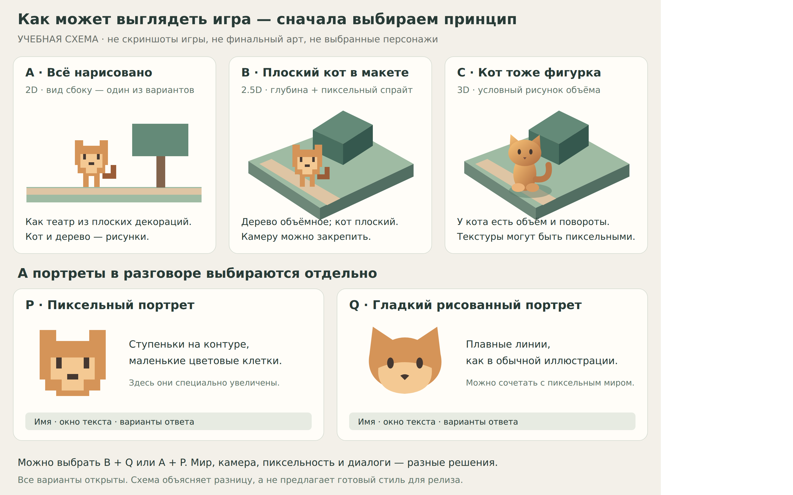

# Как выбрать вид игры: примеры и открытые вопросы

**Направление уточнено, окончательный вид ещё выбирается.** Автору нужны понятные примеры, а не повторный вопрос «2D или 2.5D?» без объяснения. Это отдельный план выбора, не производство игрового арта.

**Предыдущий ответ:** нравятся B и C, но автор не уверен, что лучше. Оба — предпочтительные кандидаты для сравнения, не утверждённая технология. Портреты P/Q тоже остаются открытыми; A не объявлен окончательно отвергнутым. Первый ответ по анкете (05.09.26): базовый ракурс — немного сверху, стартовый ракурс отдельных событий может отличаться; повороты кота — пока не решено; портреты — вопрос переобъяснён примером, решение открыто.

**Новое предпочтение 06.09.2026:** «наверное всеже плоский кот в макете». Сделаны [два кадра пролога](../../../../prologue/art/plan.md) для отзыва до кода. Это приоритет сравнения, не окончательный выбор размерности; портреты по-прежнему зависят от результата рисования.

## Наглядная схема

**Последний отзыв 06.09.2026:** деревья 03 понравились, коту нужны крупность/детали и треугольные ушки; дорога/грядки ближе к 01, вода лучше, кусты больше. В [пробе 04](../../../../prologue/art/plan.md) большая карта отвергнута: вернуть компактную как в 03 с текущими метрами без спойлеров. «Ступеньки» — доски у озера, не рисунок/анимация. Карта и доски ещё не исправлены; стоящий кот неподвижен, ветер с задержками. Портрет/окончательный вид мира не утверждены.

[Редактируемый оригинал схемы](comparison.svg) · [PNG для просмотра](comparison.png). Это оригинальная учебная иллюстрация: **не скриншоты игры, не реальные 3D-модели и не финальная внешность персонажей**. Условный окрас нужен только для сравнения одинакового образа. Схема показывает устройство кадра, а не обещает художественное качество будущей игры. PNG — проверенный рендер SVG; после правки оригинала его нужно обновить, чтобы примеры не расходились.

## A / B / C — как устроен мир

| Вариант | Представь | Что заметишь в игре | Что спросить у себя |
| --- | --- | --- | --- |
| A. Плоский мир, пиксельный кот | Театр из нарисованных декораций: кот идёт по дорожке, фон может состоять из нескольких слоёв | Персонаж и окружение рисуются кадрами; камера может показывать сбоку или сверху. 2D не обязательно означает платформер с прыжками | Мне нравится смотреть на дорогу сбоку? Хочу ли я движение в глубину? |
| B. Объёмный мир, пиксельный кот | Небольшой макет с домиками и деревьями, среди которых стоит плоская фигурка кота | Вокруг есть глубина, тени и перекрытия; сам кот — нарисованный спрайт. Это один конкретный смысл «2.5D», а не универсальное определение | Хочу глубину, сохранив пиксельного кота? Устраивает фиксированная камера? |
| C. Объёмный мир и объёмный кот | Макет, где кот тоже фигурка, которую можно показать с разных сторон | Для кота нужны модель и анимация. Камеру всё равно можно зафиксировать; свободное вращение не обязательно. Пиксельные текстуры возможны и здесь | Мне важно видеть объём и повороты тела или достаточно нарисованных кадров? |

Сравнивается одна задача — кот на дороге рядом с деревом. B не означает «A, но бесплатно красивее»: нужны объёмное окружение и согласование его со спрайтами. C не обязательно реалистичный: кот может оставаться очень условным. Ни один вариант не гарантирует качество без хороших ассетов и проверки.

Для первой небольшой пробы можно начать с B и фиксированной камеры, если приоритет — рисованный пиксельный кот и немного направлений движения. Если важно обходить кота камерой и видеть непрерывные повороты тела, C удобнее рассмотреть первым. Это условная рекомендация, не выбор за автора: множество направлений спрайта тоже дорого рисовать, а готовая подходящая модель может изменить сравнение. Портреты стоит выбирать отдельно по читаемости эмоций, не автоматически вслед за миром.

## P / Q — что видно в разговоре

**P. Пиксельный портрет:** контуры и цветовые пятна намеренно выложены маленькими квадратами. В подробном портрете могут быть хорошо читаемые глаза, усы и эмоции; пиксель-арт не обязан состоять из десяти крупных блоков. На схеме пиксели увеличены, чтобы разница была видна.

**Q. Гладкий рисованный портрет:** контур похож на иллюстрацию, линии плавные. Такой портрет можно показывать рядом с пиксельным игровым миром, если совпадают пропорции, окрас и настроение. Он не обязан быть аниме или фотореализмом.

Оба варианта могут иметь одно и то же окно текста, имя, эмоции и кнопки ответов — это и есть [новелльная подача](../../dialogues/plan.md). Чёткий непиксельный шрифт допустим в обоих. Разрешение портретов можно сделать выше, чем у кота на дороге.

## Наглядные пробы (06.09.2026)

По просьбе автора сделаны схемы-пробы «как может выглядеть игра» — [отдельная страница с пятью картинками](probes/plan.md): экран целиком (мир B и HUD), портреты P/Q, крупность пикселей, повороты B/C, подача мрачной сцены. Это схемы, не скриншоты и не финальный арт; автор смотрит и говорит, что не так.

## Анкета на потом — отвечать не обязательно сейчас

| Вопрос | Пример ответа | Текущее решение |
| --- | --- | --- |
| Какой мир интереснее: A, B или C? | «B, но без вращения камеры» / «Пока не понимаю, покажи другую сцену» | Пиксельное объёмное окружение, не округлое; плоский пиксельный/квадратный кот в текущей пробе |
| Смотрим сбоку, немного сверху или из-за героя? | «Слегка сверху, чтобы видеть дорожку за деревом» | Немного сверху — базовый ракурс; стартовый ракурс отдельных событий может отличаться (05.09.26) |
| Повороты кота: нарисованные направления или плавный объёмный поворот? | «Хватит нескольких направлений» / «Важно видеть спину и бок» | Пока не решено (05.09.26) |
| Что значит «не слишком пиксельная»? | «Видны пиксели, но мордочку и эмоции легко различить» | Открыто |
| Портрет P или Q? | «Q, а на дороге пусть кот остаётся пиксельным» | Открыто; вопрос переобъяснён примером (05.09.26) |
| Как портрет занимает экран? | «По плечи рядом с текстом» / «По пояс по сторонам экрана» | Открыто |
| Что не нравится в схеме? | «Слишком крупные квадраты» / «Не хочу такой ракурс» | Открыто |

Можно выбрать только понравившуюся деталь; это не утверждает весь вариант. Не назначать движок, внешность героев или художественный стиль из одного ответа про камеру. После выбора направления следующая задача — одна настоящая стилевая проба, только по запросу автора; не сразу три игры.

[Основной план графики](../plan.md) · [Все вопросы](../../../planning/questions/README.md) · [Контекст передачи](../../../../../CONTEXT.md)
