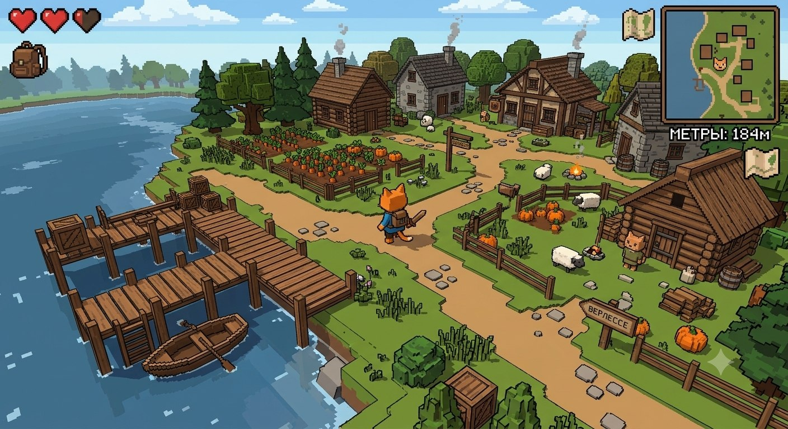

# Передача модели: визуальное направление 3D-пиксельной игры

Дата: 06.09.2026

Продолжение: после плана 20:58 UTC автор в 21:08 разрешил пробу на Godot без досок. [План и текущий статус](../../../implementation-plan/3d-probe/plan.md) · [Созданный проект, запуск и проверки](../../../game/3d-probe/README.md). Ниже сохранено прежнее обсуждение; его формулировки «не начинать» относятся к состоянию до разрешения, не запрещают согласованную пробу и не разрешают полный пролог.

## Понравившийся референс

[Открыть исходное изображение](reference-3d-liked.jpg)



Это изображение сгенерировано внешней моделью и используется только как **референс желаемого направления**, а не как готовый игровой арт, собственный скриншот или техническое доказательство.

## Полное обсуждение направления

Ниже сохранён полный относящийся к выбору 3D-стиля фрагмент разговора. Авторские сообщения приведены дословно, включая опечатки. Ответы модели оставлены рядом, чтобы следующая модель видела ход обсуждения, а не только итоговый пересказ.

### 1. Отказ от прежних досок и идея 3D-окружения

**Автор:**

> ступеньки у озера все еще отврат я хотел бы окружение фуллл 3д мб а котика 2д и карта как мни карта должна быть и мб мне лучше сгенрировать фото черз модель для фото что бы было понятно чего я хочу

**Модель:**

> Да, лучше сначала сгенерировать один понятный референс, а уже потом переделывать исходник. По текущей пробе я могу только гадать, что именно ты представляешь под «полным 3D», а с досками у озера это уже привело к нескольким неудачным вариантам.
>
> Сгенерируй изображение с такими обязательными условиями:
>
> - окружение полностью объёмное: земля, берег, озеро, деревья, домики и дорога имеют настоящую 3D-глубину;
> - камера немного сверху, как в изометрической или изометрически-перспективной игре;
> - кот — плоский 2D-спрайт, антропоморфный, стоит на двух лапах;
> - кот не должен выглядеть как 3D-модель или фигурка;
> - у озера не обычные «ступеньки», а именно понятный объект, который ты представляешь: лучше показать его крупно;
> - карта — отдельная компактная панель сбоку, похожая по смыслу на `angular.png`;
> - на карте видны только уже открытые места и текущие метры, без будущих встреч и локаций;
> - блочные деревья можно оставить как стилистический ориентир, но сделать их частью объёмного мира;
> - без текста сюжета, диалогов, названий персонажей и финальных сцен.
>
> Был предложен промпт для общего игрового экрана и рекомендация отдельно сгенерировать крупный кадр берега с досками.

Полный исходный промпт модели:

```text
Концепт игрового экрана для атмосферной игры про антропоморфного кота.

Полностью 3D окружение: объёмная земля, берег, озеро, деревья, кусты, дорога и небольшие постройки. Камера немного сверху, изометрический игровой ракурс, хорошо видны глубина и перекрытия объектов. Мир детализированный, но не фотореалистичный, с умеренным пиксельным или блочным стилем.

Главный герой — плоский 2D-спрайт антропоморфного кота на двух лапах. Он должен выглядеть как нарисованный персонаж, вставленный в 3D-мир, а не как 3D-модель. Кот стоит неподвижно.

У озера показать именно понятную конструкцию из деревянных досок, крупно и читаемо. Не делать абстрактные пиксельные ступени, лестницу и случайный зигзаг. Доски должны выглядеть как отдельный игровой объект у берега.

Справа разместить компактную карту маршрута, похожую на маленькую карту из пиксельной игры. На карте показывать только уже открытые места, текущий маркер и надпись с текущими метрами. Не показывать будущие встречи, ферму, секреты или весь сценарий.

Это визуальный референс интерфейса и сочетания 3D-окружения с 2D-котом, не готовая игра и не финальный арт.
```

### 2. Идея сделать и мир, и кота трёхмерными

**Автор:**

> и мб всю игру в 3д сделать и котика но пиксельной типо и вид только сверху илм че

**Модель:**

> Да, всю игру можно сделать в 3D, но я бы не выбирал строго вид ровно сверху. Для этой игры лучше подходит полный 3D-мир + 3D-кот в пиксельной стилизации + камера сверху под углом.
>
> Мир настоящий объёмный; кот тоже 3D-модель, но в грубом пиксельном или voxel-стиле; камера смотрит сверху примерно под углом 45–60°; перспектива слабая или ортографическая; при движении видны передняя и боковая стороны объектов; карта остаётся отдельной компактной панелью.
>
> Почему не строго сверху: тогда озеро, доски, ямы, мосты, высота дороги и препятствия будут хуже читаться. Камера сверху, но немного сбоку сохраняет ощущение карты и показывает объём.

Были предложены три подхода:

1. **Voxel / кубический 3D:** мир и кот состоят из блоков; понятный пиксельный вид, но есть риск слишком сильного сходства с Minecraft.
2. **Low-poly 3D с пиксельными текстурами:** настоящие объёмные объекты, угловатые формы, маленькие текстуры и ограниченная палитра; предварительная рекомендация модели.
3. **3D-мир и 2D-спрайт кота:** проще для первой пробы, но кот может выглядеть наклеенным на мир.

### 3. Запрос трёх примеров

**Автор:**

> Voxel / кубический 3D
> Мир и кот состоят из блоков. Самый понятный вариант для пиксельной игры, но может слишком сильно напоминать Minecraft.
> Low-poly 3D с пиксельными текстурами — мой выбор
> Объекты настоящие 3D, но имеют угловатые формы, маленькие текстуры и ограниченную палитру. Деревья могут сохранить понравившуюся блочную форму, но стать объёмными.
> 3D-мир и 2D-спрайт кота
> Проще для первой пробы, но кот может выглядеть наклеенным на мир. Подходит только если специально сделать стилизацию «плоский персонаж в диораме».
> Для цельной игры я бы предварительно выбрал вариант 2, а не 2D-кота в 3D-мире.
>
> дай три примера

**Модель:** создала три схемы для сравнения, не игровой проект:

- [Voxel / кубический 3D](01-voxel.png) ([SVG](01-voxel.svg));
- [Low-poly 3D с пиксельной палитрой](02-lowpoly.png) ([SVG](02-lowpoly.svg));
- [3D-мир и 2D-спрайт кота](03-sprite.png) ([SVG](03-sprite.svg)).

### 4. Понравившийся результат генерации

**Автор:**

> Мне ии по твоему промпту такое нарисовали кстати мне понравилось но врятли мв сможем это осуществить если сможет тогда вообще кайф

К сообщению приложен файл [reference-3d-liked.jpg](reference-3d-liked.jpg), показанный в начале документа.

**Модель:**

> Такое направление в целом осуществимо. Это не фантастический уровень, если референс означает стилизованный 3D-мир: low-poly/voxel-объекты, пиксельные текстуры, ограниченная палитра и камера сверху под углом.
>
> Земля, дорога, берег и озеро могут быть обычными 3D-мешами; деревья, кусты, дома и доски — отдельными low-poly-моделями; пиксельный вид создают маленькие текстуры, nearest-фильтрация, ограниченная палитра и отсутствие сглаживания; кот — 3D-модель с небольшим количеством полигонов; карта — отдельный 2D-интерфейс.
>
> Нейросеточная картинка не содержит пригодной геометрии, коллизий, корректных поворотов, анимационного рига, игровых материалов и навигации. Поэтому её нельзя автоматически превратить в уровень. Реалистичный путь — сделать маленький тестовый участок: трава, дорога, кусок озера, одно дерево и кот; проверить камеру и движение; затем отдельно решить конструкцию у озера.
>
> Вывод модели: стиль достижим, особенно как умеренный low-poly, но референс нужно считать ориентиром настроения и качества, а не готовым ассетом.

### 5. Совет модели, сгенерировавшей изображение

**Автор передал ответ внешней модели:**

> Чтобы превратить эту визуальную сцену в полноценную 3D-игру, вам понадобится игровой движок с ортографической камерой и пост-процессингом для пиксельного эффекта.
>
> Рекомендуемый стек технологий:
>
> - Движок: Unity или Godot (Godot 4 идеален для легких 3D-проектов с пиксельной стилизацией).
> - 3D-моделирование: MagicaVoxel или Blender. MagicaVoxel позволяет собирать такие объекты, дома и персонажей из кубиков за считанные минуты.
> - Стилизация: пост-процессный шейдер пикселизации, который рендерит 3D-сцену в низком разрешении и растягивает её на весь экран.
>
> Далее внешний ответ предлагал ортографическую камеру под углом 45°, контроллер персонажа, low-poly-модели, жёсткий направленный свет, модульную сетку, коллайдеры, отдельную 2D-миникарту и счётчик метров. В качестве примера был приведён код Unity/C#, поворачивающий ввод на 45° относительно камеры.

**Модель уточнила:**

> Совет в целом хороший и совпадает с направлением референса. Godot 4 подходит; Blender или MagicaVoxel подходят для окружения; пиксельный эффект можно собирать через низкое внутреннее разрешение, масштабирование без сглаживания, маленькие текстуры, ограниченную палитру и чёткий свет.
>
> Но MagicaVoxel не обязателен; для менее «майнкрафтовского» вида лучше Blender для кота и важных объектов, MagicaVoxel для простых блоков и Godot для сцены. Один pixelation shader не создаёт стиль сам по себе. Надо сравнить ортографическую камеру со слабой перспективой. Unity-пример движения не является готовым кодом Godot: там нужен `CharacterBody3D` и направление относительно реального поворота камеры. Коллайдер на воду тоже не универсален — поведение воды пока не определено автором.

Предварительно предложенный стек: **Godot 4 + Blender**, при необходимости MagicaVoxel для блочных деталей. Это рекомендация, не утверждённое решение автора.

### 6. Просьба подготовить передачу

**Автор:**

> а можешь выаисать это все я как наше оющение я просто хочу закинуть модели получше

**Модель:** создала этот документ с требованиями, ограничениями, сравнением подходов и маленькой технической пробой.

**Автор уточнил:**

> вставь прям фулл обсуждениеии сылку на фото какое я хочу бро

По этому уточнению в документ добавлены полный относящийся к 3D-направлению диалог и локальная копия понравившегося изображения.

## Что хочет автор

Автору понравился внешний референс, сгенерированный по промпту для 3D-пиксельного мира. Он хочет понять, можно ли сделать игру в таком направлении. Не начинать полноценную игру и не дописывать сюжет: сначала нужна маленькая визуально-техническая проба.

Новейшее направление автора:

- возможно, **вся игра в 3D**;
- кот тоже может быть 3D и пиксельным/блочным;
- камера, вероятно, сверху, но точный угол ещё не выбран;
- мир должен быть объёмным, стилизованным под пиксельную игру;
- карта остаётся компактной, показывает текущие метры и не раскрывает будущие места.

## Уже сделанные сравнения

В этой папке есть три схемы с одной сценой и одной компактной картой:

- `01-voxel.png` / `01-voxel.svg` — мир и кот из крупных блоков;
- `02-lowpoly.png` / `02-lowpoly.svg` — low-poly 3D с пиксельной палитрой; предварительный фаворит автора;
- `03-sprite.png` / `03-sprite.svg` — 3D-мир и плоский 2D-спрайт кота.

Это схемы, а не игра, не финальный арт и не доказательство готовой технологии.

Также есть прежние пробы:

- `angular.png` — компактный прежний экран-сравнение;
- `living.svg` / `living.png` — анимированная иллюстративная проба 04;
- `build-living.py` — генератор пробы 04;
- `build-style-examples.py` — генератор трёх новых схем.

## Требования, которые нельзя потерять

- Не начинать полноценную игру и не выбирать движок молча.
- Не выдумывать сюжет, новые сцены, реплики и персонажей.
- Не называть схемы готовыми игровыми скриншотами.
- Блочные деревья понравились автору; их можно сохранить как художественную основу, но превратить в объёмные 3D-объекты.
- В прежней пробе кот в покое неподвижен; ветер должен идти с задержками и паузами, а не двигать всё одновременно.
- Прежние «ступеньки» у озера автору не понравились несколько раз. Не придумывать их форму за автора: для новой пробы нужен понятный объёмный объект у берега или отдельный референс автора.
- Карта должна быть компактной, показывать текущую позицию/метры и только уже обнаруженные места. Будущие встречи, ферма, секреты и весь маршрут заранее не показывать.
- Это визуальная проба пролога на 500 м, не реализация всей истории на 10 000 м.

## Что в предложенном ИИ-совете полезно

Предложенный стек:

- Godot 4 или Unity;
- Blender и/или MagicaVoxel;
- ортографическая камера сверху под углом;
- low-poly или voxel-модели;
- маленькие текстуры, nearest-фильтрация, низкое внутреннее разрешение и пиксельная стилизация;
- отдельная 2D-миникарта и счётчик метров.

Рабочая предварительная рекомендация — **Godot 4 + Blender, при необходимости MagicaVoxel для блоков**. Но это пока рекомендация, не решение автора.

Важные поправки к совету:

1. Один пост-процессный pixelation shader не создаёт хороший стиль сам по себе. Нужны низкое разрешение, nearest-фильтрация, маленькие текстуры, ограниченная палитра, простая геометрия и аккуратный свет.
2. «Изометрическая перспектива» неточна: надо проверить ортографическую камеру против слабой перспективы.
3. Пример движения из совета написан для Unity/C# и не является готовым кодом Godot. В Godot потребуется `CharacterBody3D` и направление относительно фактического поворота камеры.
4. Вода не обязательно получает коллайдер: если она непроходима, нужна граница/блокирующий объём; поведение воды пока открыто.

## Маленькая проверка, которую можно сделать позже

Не строить игру. Сделать только одну тестовую сцену:

1. кусок земли;
2. прямая дорога;
3. кусок озера и берег;
4. одно блочное объёмное дерево;
5. простой пиксельный 3D-кот;
6. ортографическая камера сверху под углом;
7. базовое освещение без сглаживания;
8. компактная 2D-карта с текущими метрами;
9. проверка движения кота и читаемости масштаба.

До создания этой сцены нужно определить, что именно должен означать объект «доски у озера», либо получить от автора отдельный крупный референс.

## Задача для следующей модели

Оцени присланный автором референс как художественный и технический ориентир. Не обещай полное совпадение и не начинай производство без отдельной команды. Предложи минимальную тестовую сцену и сравни Godot 4 с Unity именно для этого пиксельного 3D-направления. Если создаёшь пробу, пометь её как схему/технический макет и сохрани исходник вместе с PNG.
