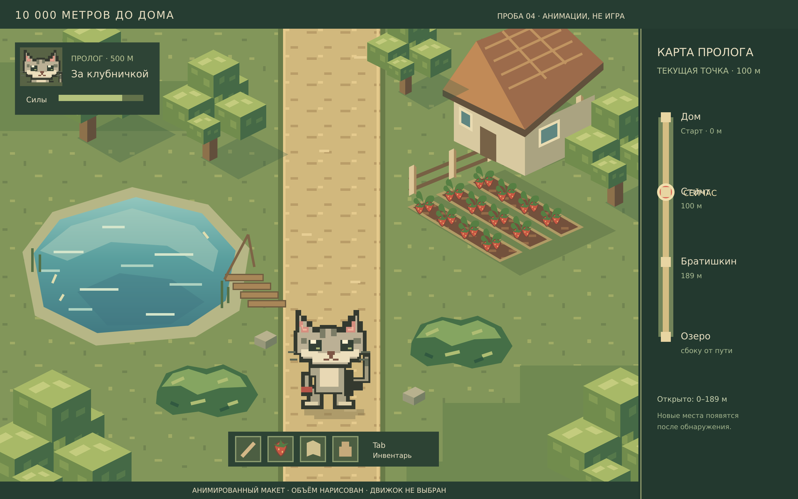
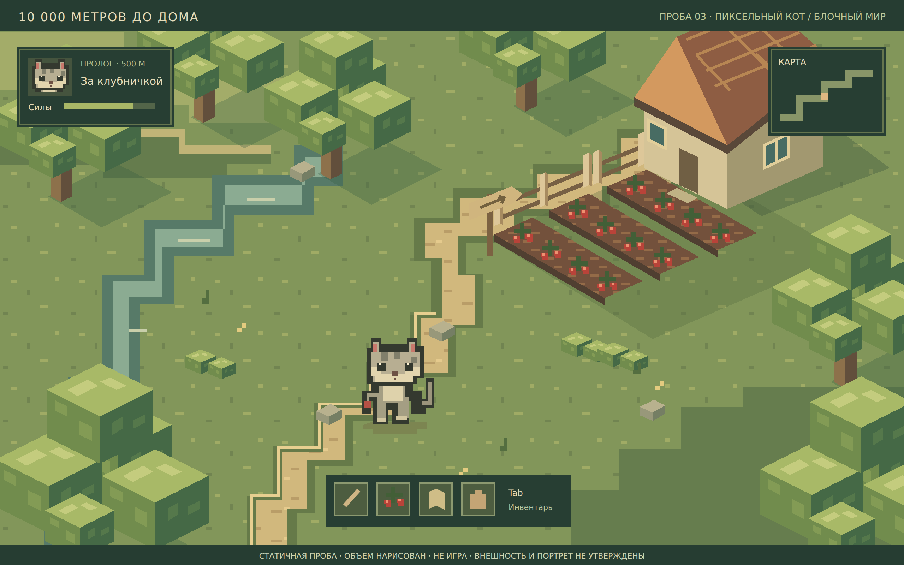
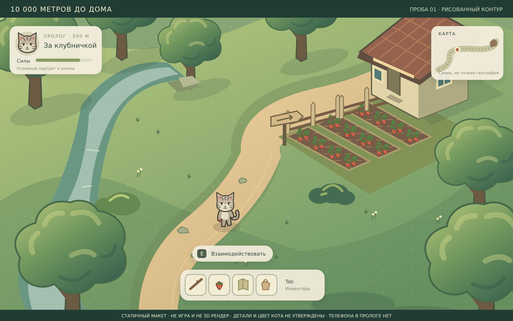

# Пролог: визуальные пробы до игрового кода

Сделано в Hoplite 06.09.2026 по запросу автора. **Это оригинальные иллюстрации макета, не игра, не скриншоты движка, не реальные 3D-модели и не финальный арт.** Условная ферма опирается на существующую сцену; её география, окрас кота, оформление дома и численные значения не утверждены. Чужие изображения/голоса и персонажи камео не использовались.

Общая основа проб: плоский кот **на двух лапах**, а не на четырёх, и вид немного сверху. Глубина окружения только нарисована: проверка перекрытий/поворотов/света в настоящем движке впереди. Портрет и стиль мира выбираются независимо; мини-портрет здесь лишь образец, не окончательный выбор P/Q.

## Текущая проба 04 — прямая дорога и ветер

**Последний отзыв, 06.09.2026 19:43 UTC:** большая карта ниже **отвергнута**. Вернуть компактную карту как в 03 («до»), показывать текущие метры, **без спойлеров**. «Ступеньки» — это **доски у озера**, их надо переработать. **SVG/PNG/Preview обновлены:** карта возвращена к компактному виду с текущим маркером 100 м и без будущих мест; доски у озера переработаны в ступенчатый ряд. Кадр остаётся визуальной пробой, не игрой и не финальным артом.

**Отзыв автора на 03:** направление кота подходит, но он маленький и недостаточно проработанный; ушки нужны милыми треугольниками. Деревья понравились. Дорогу, грядки и растения приблизить к 01, кусты увеличить, воду переработать. Основной путь пролога — прямой, интерактив по бокам; на карте хочется видеть всё. Это подтверждение отдельных деталей, не всего арта.

[Анимированный SVG](living.svg) · [Просмотрщик с остановкой движения](index.html) · [Требования к анимациям](../animation/plan.md)

Кот увеличен примерно на треть по высоте относительно 03: треугольные ушки со ступенчатым пиксельным контуром, более крупная мордочка, усы и детали лап. Блочные деревья сохранены, вода стала озером с полосами глубины и рябью, ягоды/листья взяты из авторской пробы 01, кусты крупнее. Дорога широкая и без поворотов. Карта показывает 0–500 м и основные места; точные координаты, кроме уже заданных, не выдуманы. Совмещение озера и фермы в одном иллюстративном кадре не фиксирует их реальные расстояния в игре.

**Движение:** стоящий кот не должен двигаться, окружение — не всё одновременно, а как от порывов ветра. В текущей версии кот статичен, у растений разные задержки и паузы, вода отдельно. Игровые анимации кота нужны, но здесь не реализованы. Замечание о «ступеньках» позднее уточнено: доски у озера, не тайминг/контуры.

Это **анимированная иллюстрация**, не управляемая игра, не симуляция ветра и не готовые игровые анимации. Кнопка просмотра останавливает/возобновляет окружение; карта и предметы остаются схемой. Окрас, портрет, новые пропорции и внешний вид 04 ещё на отзыв. PNG ниже воспроизводит начальную фазу, не движение.

## Три сравниваемых 3D-направления

Это отдельные схемы-пробы с одной и той же компактной картой; они не являются рабочей игрой и не фиксируют окончательный стиль:

| Подход | Предпросмотр | Смысл |
| --- | --- | --- |
| Voxel / кубический 3D | [01-voxel.png](01-voxel.png) · [SVG](01-voxel.svg) | Мир и кот состоят из крупных блоков. |
| Low-poly 3D + пиксельные текстуры | [02-lowpoly.png](02-lowpoly.png) · [SVG](02-lowpoly.svg) | Настоящий объём, угловатые формы, ограниченная палитра. Предварительный фаворит автора. |
| 3D-мир + 2D-спрайт кота | [03-sprite.png](03-sprite.png) · [SVG](03-sprite.svg) | Проверка плоского кота в объёмной диораме. |

## Предыдущая проба 03

Автор попросил **пиксельного или квадратного кота** и **пиксельное, но объёмное окружение**: прежний фон слишком округлый. Это уточнение направления, не утверждение конкретных кубических деревьев, цветов или движка.

В [новом исходнике](angular.svg) кот нарисован ступенчатыми пиксельными формами, а не получен уменьшением гладкой картинки. Он остаётся плоской фигуркой на двух лапах; пиксель дорожного спрайта равен 3 CSS-пикселям. Деревья собраны из гранёных блоков со светлой верхней и тёмной боковой стороной, берега/дорога ступенчатые, грядки имеют толщину. Объём только **изображён в SVG**, настоящая 3D-сцена не создана. Кубическая форма — проба на отзыв, не обязательная геометрия всей игры.

Мини-портрет подогнан под условный спрайт для целостности кадра; это не выбор окончательного стиля портретов. Позднее автор одобрил деревья, попросил доработать кота, дорогу, воду, грядки и кусты; см. пробу 04 выше. Макет 03 статичный.

## Предыдущие варианты 01–02

| 01. Чистый рисованный контур | 02. Мелкий пиксельный шаг |
| --- | --- |
|  |  |
| Более плавные линии, легче читать мелкие детали | Та же композиция, но мир дискретизирован; текст и интерфейс остаются чёткими |

Вторая картинка — **проба плотности через уменьшение/увеличение**, не вручную нарисованный пиксель-арт. Она показывает ощущение от пиксельного шага, но не доказывает качество будущих анимаций. Для окончательного выбора портрета нужен увеличенный образец с эмоциями после отзыва на общий вид, не выбор «P/Q» по одной букве.

На обеих: портрет слева, карта справа, инвентарь снизу; **телефона нет**, поскольку он исключён из пролога. Шкала, предметы и кнопка показаны для масштаба интерфейса, не как готовый состав нужд или утверждённая стартовая выдача лута. Кнопки не работают. Надпись о взаимодействии не означает, что у кота уже есть доступная игровая цель.

## Что оценить

- Похоже ли это на желаемый «макет с плоским котом», или нужна другая глубина/камера?
- Кот должен быть крупнее, менее милым, более пиксельным, другого силуэта? Его текущая внешность не становится каноном.
- Достаточно ли доработан кот в 04, подходят ли вода/гряды? Карта уже отвергнута; требуется компактная с метрами без спойлеров. Замечание о досках уточнено, не спрашивать заново. Остальные детали можно оценивать отдельно.

На варианты 01–02 получен отзыв: кот нужен пиксельный/квадратный, фон слишком округлый. Эти изображения сохранены для сравнения, не как утверждённый эталон. Предыдущий [экран GLM](../../common/presentation/art/examples/probes/screen-mockup.png) — историческая схема из другой сессии, уже отвергнутая как финальный арт; ни одна проба не является скриншотом работающей игры.

## Исходники и воспроизведение

Для 04: `python3 ideas/prologue/art/build-living.py` строит `living.svg` из [исходника композиции](build-living.py) и оригинальных деталей 01/03, без библиотек и внешних ассетов. Для PNG открыть SVG напрямую; выполнить `document.getAnimations().forEach(a => { a.pause(); a.currentTime = 0; });` и снять область `svg` → `living.png`. Источник 1280×800 CSS-пикселей, PNG 2560×1600 при плотности 2×. После изменения генератора/исходных деталей перестроить SVG и PNG. Для видео открыть заново, без принудительной паузы.

Если служебная плашка браузерного инструмента мешает прямому SVG после записи, открыть `index.html`, применить ту же паузу к `document.querySelector('iframe').contentDocument.getAnimations()` и снять область `iframe` при ширине 1280 CSS-пикселей. Финальный PNG 04 получен этим способом.

Preview использует стандартный HTTP-сервер Python только для этой папки; версия команды записана в `.hoplite/settings.json`. Это просмотр художественных материалов, не команда запуска игры. Установка зависимостей и движка не нужна. Старые источники и PNG 01–03 не перезаписаны.

Для 03 открыть [angular.svg](angular.svg), снять область `svg` в PNG → `angular.png`, без фильтра уменьшения и внешних полей браузера. После изменения исходника обновить PNG.

[scene.svg](scene.svg) — оригинал прежних проб 1280×800 CSS-пикселей, открывается браузером. `soft.png` — свежий снимок области `svg` без внешних полей (плотность браузера 2×). Для `pixel.png` открыть SVG заново, выполнить [render-pixel.js](render-pixel.js) в контексте браузера и снять область `canvas`. Формат снимков задавать явно PNG. Скрипт только растеризует иллюстрацию; это не код игры. После правок SVG повторно получить оба PNG. Служебная плашка браузера, если попала в кадр, не часть макета.

[Разбор пролога](../review/plan.md) · [Порядок реализации](../../../implementation-plan/prologue/plan.md) · [Графика](../../common/presentation/art/plan.md)
